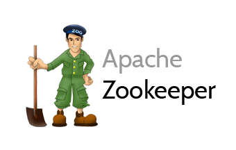

## Jelastic jplock-zookeeper Add-on

This repository provides [jplock-zookeeper](https://hub.docker.com/r/jplock/zookeeper/) add-on for Jelastic Platform.

**jplock-zookeeper** is a base docker image for [Zookeeper](http://zookeeper.apache.org/), version 3.4.8. Apache ZooKeeper is an effort to develop and maintain an open-source server which enables highly reliable distributed coordination.

**Type of nodes this add-on can be applied to**: all nodes.

### What it can be used for?
ZooKeeper is a centralized service for maintaining configuration information, naming, providing distributed synchronization, and providing group services. All of these kinds of services are used in some form or another by distributed applications. Each time they are implemented there is a lot of work that goes into fixing the bugs and race conditions that are inevitable. Because of the difficulty of implementing these kinds of services, applications initially usually skimp on them ,which make them brittle in the presence of change and difficult to manage. Even when done correctly, different implementations of these services lead to management complexity when the applications are deployed. 

Learn more about ZooKeeper on the [ZooKeeper Wiki](https://cwiki.apache.org/confluence/display/ZOOKEEPER/Index).

No initial options specified.

### Deployment

In order to get this solution instantly deployed, click the "Get It Hosted Now" button, specify your email address within the widget, choose one of the [Jelastic Public Cloud providers](https://jelastic.cloud) and press Install.

To deploy this package to Jelastic Private Cloud, import [this JPS manifest](../../raw/master/manifest.jps) within your dashboard ([detailed instruction](https://docs.jelastic.com/environment-export-import#import)).

For more information on what Jelastic add-on is and how to apply it, follow the [Jelastic Add-ons](https://github.com/jelastic-jps/jpswiki/wiki/Jelastic-Addons) reference.